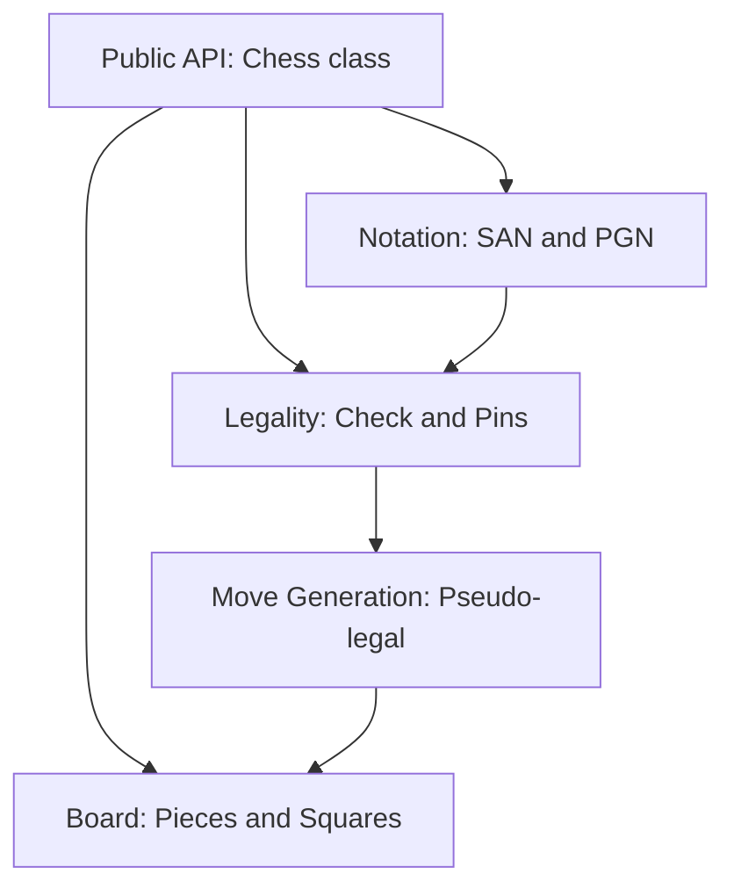

# Chess Engine Architecture and Layering

## Overview

This chess engine is built as a layered library that separates physical board representation, move generation, legality filtering, and public API orchestration. It supports both standard 8x8 chess and a four-player 14x14 variant using a unified core.

## Layering Model

1. **Board Layer**: Low-level square and piece representation.
2. **Move Generation Layer**: Produces every possible move regardless of king safety.
3. **Legality Layer**: Filters out moves that leave the king in check.
4. **Notation Layer**: Converts between internal move formats and human-readable text.
5. **Orchestration Layer**: Manages game state, history, and multi-player logic.

## Variant Support

The core is designed to be variant-agnostic. Each variant defines:
- Board dimensions
- Starting positions
- Piece movement rules
- Win/loss conditions

Currently, it supports:
- **Standard**: The classic 8x8 game.
- **4-Player**: A 14x14 board with specialized geometry and elimination rules.
