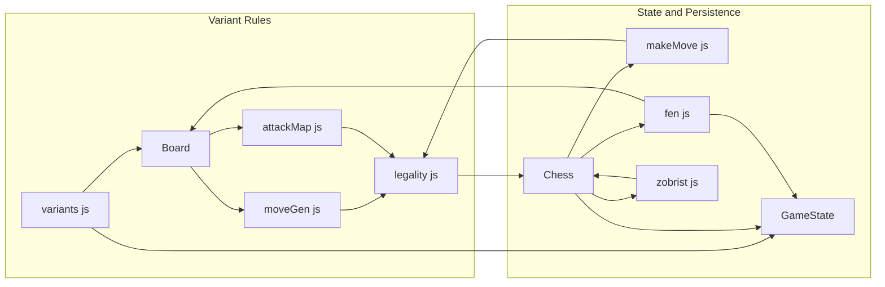

# Chess Engine Core Domain

## Overview

This domain layer implements the 4-player rule set used by the engine: a 14×14 board with masked corners, color-specific pawn direction, per-player castling, direct king-capture elimination, and chained eliminations when the next active player has no legal move. The same code path also keeps undo, repetition tracking, and state persistence aligned with those rules.

The 4-player behavior is spread across several core modules. The high-level `Chess` facade coordinates move validation, state mutation, elimination, hashing, and serialization.

## Architecture Overview

## Variant and Board Topology

The `FOUR_PLAYER` config defines the board as a 14x14 grid with 3x3 corner masks. This creates the classic "plus-sign" board layout.

### 4-player movement constants

| Player | Index | Pawn forward | Start coordinate | Promotion coordinate | Move axis |
|---|---:|---:|---:|---:|---|
| Red | 0 | `14` | `1` | `13` | Vertical |
| Blue | 1 | `1` | `1` | `13` | Horizontal |
| Yellow | 2 | `-14` | `12` | `0` | Vertical |
| Green | 3 | `-1` | `12` | `0` | Horizontal |

## Elimination Semantics

- **Direct King Capture**: Capturing a king immediately eliminates the player.
- **Piece Removal**: `poofPieces` removes all pieces for that player.
- **Turn Skipping**: Dead players are skipped in the turn order.
- **Chained Elimination**: If a player has no legal moves on their turn, they are eliminated.
